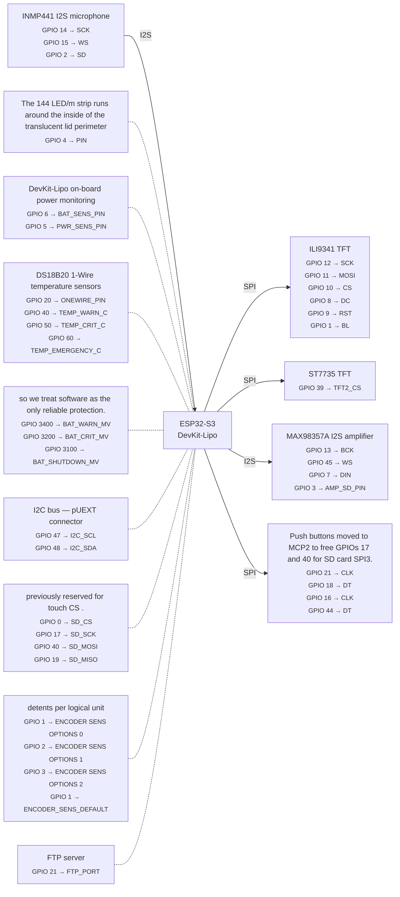

# Wiring reference

Auto-generated from `firmware/bodn/config.py`. Do not edit between the markers.

Regenerate: `uv run python tools/pinout.py --md`

<!-- pinout:start -->


### ILI9341 TFT

| Signal | GPIO | Config variable |
|--------|------|-----------------|
| SCK | 12 | `TFT_SCK` |
| MOSI | 11 | `TFT_MOSI` |
| CS | 10 | `TFT_CS` |
| DC | 8 | `TFT_DC` |
| RST | 9 | `TFT_RST` |
| BL | 1 | `TFT_BL` |

### ST7735 TFT

| Signal | GPIO | Config variable |
|--------|------|-----------------|
| TFT2_CS | 39 | `TFT2_CS` |

### INMP441 I2S microphone

| Signal | GPIO | Config variable |
|--------|------|-----------------|
| SCK | 14 | `I2S_MIC_SCK` |
| WS | 15 | `I2S_MIC_WS` |
| SD | 2 | `I2S_MIC_SD` |

### MAX98357A I2S amplifier

| Signal | GPIO | Config variable |
|--------|------|-----------------|
| BCK | 13 | `I2S_SPK_BCK` |
| WS | 45 | `I2S_SPK_WS` |
| DIN | 7 | `I2S_SPK_DIN` |
| AMP_SD_PIN | 3 | `AMP_SD_PIN` |

### Push buttons moved to MCP2 to free GPIOs 17 and 40 for SD card SPI3.

| Signal | GPIO | Config variable |
|--------|------|-----------------|
| CLK | 21 | `ENC1_CLK` |
| DT | 18 | `ENC1_DT` |
| CLK | 16 | `ENC2_CLK` |
| DT | 44 | `ENC2_DT` |

### The 144 LED/m strip runs around the inside of the translucent lid perimeter

| Signal | GPIO | Config variable |
|--------|------|-----------------|
| PIN | 4 | `NEOPIXEL_PIN` |

### DevKit-Lipo on-board power monitoring

| Signal | GPIO | Config variable |
|--------|------|-----------------|
| BAT_SENS_PIN | 6 | `BAT_SENS_PIN` |
| PWR_SENS_PIN | 5 | `PWR_SENS_PIN` |

### DS18B20 1-Wire temperature sensors

| Signal | GPIO | Config variable |
|--------|------|-----------------|
| ONEWIRE_PIN | 20 | `ONEWIRE_PIN` |
| TEMP_WARN_C | 40 | `TEMP_WARN_C` |
| TEMP_CRIT_C | 50 | `TEMP_CRIT_C` |
| TEMP_EMERGENCY_C | 60 | `TEMP_EMERGENCY_C` |

### so we treat software as the only reliable protection.

| Signal | GPIO | Config variable |
|--------|------|-----------------|
| BAT_WARN_MV | 3400 | `BAT_WARN_MV` |
| BAT_CRIT_MV | 3200 | `BAT_CRIT_MV` |
| BAT_SHUTDOWN_MV | 3100 | `BAT_SHUTDOWN_MV` |

### I2C bus — pUEXT connector

| Signal | GPIO | Config variable |
|--------|------|-----------------|
| I2C_SCL | 47 | `I2C_SCL` |
| I2C_SDA | 48 | `I2C_SDA` |

### previously reserved for touch CS .

| Signal | GPIO | Config variable |
|--------|------|-----------------|
| SD_CS | 0 | `SD_CS` |
| SD_SCK | 17 | `SD_SCK` |
| SD_MOSI | 40 | `SD_MOSI` |
| SD_MISO | 19 | `SD_MISO` |

### detents per logical unit

| Signal | GPIO | Config variable |
|--------|------|-----------------|
| ENCODER SENS OPTIONS 0 | 1 | `ENCODER_SENS_OPTIONS[0]` |
| ENCODER SENS OPTIONS 1 | 2 | `ENCODER_SENS_OPTIONS[1]` |
| ENCODER SENS OPTIONS 2 | 3 | `ENCODER_SENS_OPTIONS[2]` |
| ENCODER_SENS_DEFAULT | 1 | `ENCODER_SENS_DEFAULT` |

### FTP server

| Signal | GPIO | Config variable |
|--------|------|-----------------|
| FTP_PORT | 21 | `FTP_PORT` |

### All GPIOs

| GPIO | Component | Signal |
|------|-----------|--------|
| 0 | previously reserved for touch CS . | SD_CS |
| 1 | detents per logical unit | ENCODER_SENS_DEFAULT |
| 2 | detents per logical unit | ENCODER SENS OPTIONS 1 |
| 3 | detents per logical unit | ENCODER SENS OPTIONS 2 |
| 4 | The 144 LED/m strip runs around the inside of the translucent lid perimeter | PIN |
| 5 | DevKit-Lipo on-board power monitoring | PWR_SENS_PIN |
| 6 | DevKit-Lipo on-board power monitoring | BAT_SENS_PIN |
| 7 | MAX98357A I2S amplifier | DIN |
| 8 | ILI9341 TFT | DC |
| 9 | ILI9341 TFT | RST |
| 10 | ILI9341 TFT | CS |
| 11 | ILI9341 TFT | MOSI |
| 12 | ILI9341 TFT | SCK |
| 13 | MAX98357A I2S amplifier | BCK |
| 14 | INMP441 I2S microphone | SCK |
| 15 | INMP441 I2S microphone | WS |
| 16 | Push buttons moved to MCP2 to free GPIOs 17 and 40 for SD card SPI3. | CLK |
| 17 | previously reserved for touch CS . | SD_SCK |
| 18 | Push buttons moved to MCP2 to free GPIOs 17 and 40 for SD card SPI3. | DT |
| 19 | previously reserved for touch CS . | SD_MISO |
| 20 | DS18B20 1-Wire temperature sensors | ONEWIRE_PIN |
| 21 | FTP server | FTP_PORT |
| 39 | ST7735 TFT | TFT2_CS |
| 40 | previously reserved for touch CS . | SD_MOSI |
| 44 | Push buttons moved to MCP2 to free GPIOs 17 and 40 for SD card SPI3. | DT |
| 45 | MAX98357A I2S amplifier | WS |
| 47 | I2C bus — pUEXT connector | I2C_SCL |
| 48 | I2C bus — pUEXT connector | I2C_SDA |
| 50 | DS18B20 1-Wire temperature sensors | TEMP_CRIT_C |
| 60 | DS18B20 1-Wire temperature sensors | TEMP_EMERGENCY_C |
| 3100 | so we treat software as the only reliable protection. | BAT_SHUTDOWN_MV |
| 3200 | so we treat software as the only reliable protection. | BAT_CRIT_MV |
| 3400 | so we treat software as the only reliable protection. | BAT_WARN_MV |

> **Pin conflicts detected:**
> - **GPIO 40**: DS18B20 1-Wire temperature sensors: TEMP_WARN_C / previously reserved for touch CS .: SD_MOSI
> - **GPIO 1**: ILI9341 TFT: BL / detents per logical unit: ENCODER SENS OPTIONS 0
> - **GPIO 2**: INMP441 I2S microphone: SD / detents per logical unit: ENCODER SENS OPTIONS 1
> - **GPIO 3**: MAX98357A I2S amplifier: AMP_SD_PIN / detents per logical unit: ENCODER SENS OPTIONS 2
> - **GPIO 1**: detents per logical unit: ENCODER SENS OPTIONS 0 / detents per logical unit: ENCODER_SENS_DEFAULT
> - **GPIO 21**: Push buttons moved to MCP2 to free GPIOs 17 and 40 for SD card SPI3.: CLK / FTP server: FTP_PORT
<!-- pinout:end -->

## Encoder roles and placement

Two KY-040 rotary encoders with dual roles. Mount them in a horizontal row
next to the TFT display:

| Position | Encoder | Config index | Role | Rotation | Button press |
|----------|---------|-------------|------|----------|--------------|
| Left | ENC1 | `ENC_NAV` (0) | Navigation + Param B | Home: scroll modes / Games: parameter B (speed, cursor X) | Home: enter mode / Games: tap = action, long hold = pause menu |
| Right | ENC2 | `ENC_A` (1) | Parameter A | Mode-specific (e.g. brightness, cursor Y) | Mode-specific (e.g. start/stop, cycle) |

**Key rules:**

- **NAV doubles as parameter B in game modes.** Rotation controls a
  second parameter (speed, horizontal cursor, etc.). Short taps trigger
  game actions. Long press (1.5s hold) opens the pause menu.
- **ENC_A is mode-specific.** Each mode decides what it controls.
  In Demo mode: brightness. In Garden: cursor Y. In Flöde: segment select.
- **Place NAV closest to the display** so the child's dominant hand
  naturally reaches both the screen and the nav knob.

### Suggested panel layout

```
  ┌──────────────────────────────────────────────────────────┐
  │                                                          │
  │    ┌────────────┐                                        │
  │    │            │                                        │
  │    │   Display  │         [NAV]         [ENC A]          │
  │    │  240×320   │           ◎              ◎             │
  │    │            │                                        │
  │    └────────────┘                                        │
  │                                                          │
  │    [BTN0] [BTN1] [BTN2] [BTN3]         [SW0] [SW1]      │
  │    [BTN4] [BTN5] [BTN6] [BTN7]                          │
  │                                                          │
  │    ═══════ NeoPixel sticks (2×8 LEDs) ═══════            │
  │                                                          │
  └──────────────────────────────────────────────────────────┘
```

- Display and encoders grouped together at top for menu interaction.
- Buttons in a 4×2 grid below — each button maps to a pattern/colour.
- Toggle switches to the right of the buttons.
- NeoPixel strip at the bottom, visible to the child during play.


