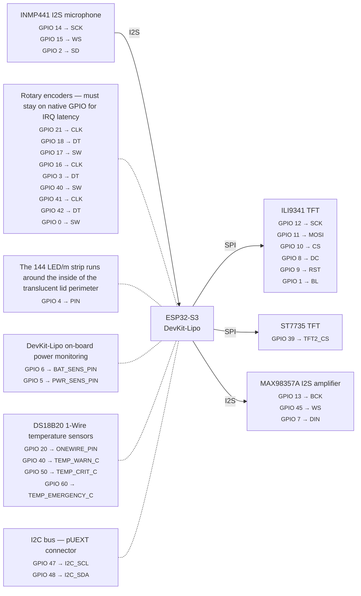

# Wiring reference

Auto-generated from `firmware/bodn/config.py`. Do not edit between the markers.

Regenerate: `uv run python tools/pinout.py --md`

<!-- pinout:start -->


### ILI9341 TFT

| Signal | GPIO | Config variable |
|--------|------|-----------------|
| SCK | 12 | `TFT_SCK` |
| MOSI | 11 | `TFT_MOSI` |
| CS | 10 | `TFT_CS` |
| DC | 8 | `TFT_DC` |
| RST | 9 | `TFT_RST` |
| BL | 1 | `TFT_BL` |

### ST7735 TFT

| Signal | GPIO | Config variable |
|--------|------|-----------------|
| TFT2_CS | 39 | `TFT2_CS` |

### INMP441 I2S microphone

| Signal | GPIO | Config variable |
|--------|------|-----------------|
| SCK | 14 | `I2S_MIC_SCK` |
| WS | 15 | `I2S_MIC_WS` |
| SD | 2 | `I2S_MIC_SD` |

### MAX98357A I2S amplifier

| Signal | GPIO | Config variable |
|--------|------|-----------------|
| BCK | 13 | `I2S_SPK_BCK` |
| WS | 45 | `I2S_SPK_WS` |
| DIN | 7 | `I2S_SPK_DIN` |

### Rotary encoders — must stay on native GPIO for IRQ latency

| Signal | GPIO | Config variable |
|--------|------|-----------------|
| CLK | 21 | `ENC1_CLK` |
| DT | 18 | `ENC1_DT` |
| SW | 17 | `ENC1_SW` |
| CLK | 16 | `ENC2_CLK` |
| DT | 3 | `ENC2_DT` |
| SW | 40 | `ENC2_SW` |
| CLK | 41 | `ENC3_CLK` |
| DT | 42 | `ENC3_DT` |
| SW | 0 | `ENC3_SW` |

### The 144 LED/m strip runs around the inside of the translucent lid perimeter

| Signal | GPIO | Config variable |
|--------|------|-----------------|
| PIN | 4 | `NEOPIXEL_PIN` |

### DevKit-Lipo on-board power monitoring

| Signal | GPIO | Config variable |
|--------|------|-----------------|
| BAT_SENS_PIN | 6 | `BAT_SENS_PIN` |
| PWR_SENS_PIN | 5 | `PWR_SENS_PIN` |

### DS18B20 1-Wire temperature sensors

| Signal | GPIO | Config variable |
|--------|------|-----------------|
| ONEWIRE_PIN | 20 | `ONEWIRE_PIN` |
| TEMP_WARN_C | 40 | `TEMP_WARN_C` |
| TEMP_CRIT_C | 50 | `TEMP_CRIT_C` |
| TEMP_EMERGENCY_C | 60 | `TEMP_EMERGENCY_C` |

### I2C bus — pUEXT connector

| Signal | GPIO | Config variable |
|--------|------|-----------------|
| I2C_SCL | 47 | `I2C_SCL` |
| I2C_SDA | 48 | `I2C_SDA` |

### All GPIOs

| GPIO | Component | Signal |
|------|-----------|--------|
| 0 | Rotary encoders — must stay on native GPIO for IRQ latency | SW |
| 1 | ILI9341 TFT | BL |
| 2 | INMP441 I2S microphone | SD |
| 3 | Rotary encoders — must stay on native GPIO for IRQ latency | DT |
| 4 | The 144 LED/m strip runs around the inside of the translucent lid perimeter | PIN |
| 5 | DevKit-Lipo on-board power monitoring | PWR_SENS_PIN |
| 6 | DevKit-Lipo on-board power monitoring | BAT_SENS_PIN |
| 7 | MAX98357A I2S amplifier | DIN |
| 8 | ILI9341 TFT | DC |
| 9 | ILI9341 TFT | RST |
| 10 | ILI9341 TFT | CS |
| 11 | ILI9341 TFT | MOSI |
| 12 | ILI9341 TFT | SCK |
| 13 | MAX98357A I2S amplifier | BCK |
| 14 | INMP441 I2S microphone | SCK |
| 15 | INMP441 I2S microphone | WS |
| 16 | Rotary encoders — must stay on native GPIO for IRQ latency | CLK |
| 17 | Rotary encoders — must stay on native GPIO for IRQ latency | SW |
| 18 | Rotary encoders — must stay on native GPIO for IRQ latency | DT |
| 20 | DS18B20 1-Wire temperature sensors | ONEWIRE_PIN |
| 21 | Rotary encoders — must stay on native GPIO for IRQ latency | CLK |
| 39 | ST7735 TFT | TFT2_CS |
| 40 | DS18B20 1-Wire temperature sensors | TEMP_WARN_C |
| 41 | Rotary encoders — must stay on native GPIO for IRQ latency | CLK |
| 42 | Rotary encoders — must stay on native GPIO for IRQ latency | DT |
| 45 | MAX98357A I2S amplifier | WS |
| 47 | I2C bus — pUEXT connector | I2C_SCL |
| 48 | I2C bus — pUEXT connector | I2C_SDA |
| 50 | DS18B20 1-Wire temperature sensors | TEMP_CRIT_C |
| 60 | DS18B20 1-Wire temperature sensors | TEMP_EMERGENCY_C |

> **Pin conflicts detected:**
> - **GPIO 40**: Rotary encoders — must stay on native GPIO for IRQ latency: SW / DS18B20 1-Wire temperature sensors: TEMP_WARN_C
<!-- pinout:end -->

## Encoder roles and placement

The three KY-040 rotary encoders have fixed roles in the UI. Mount them in
a horizontal row directly next to (or below) the TFT display, left to right:

| Position | Encoder | Config index | Role | Rotation | Button press |
|----------|---------|-------------|------|----------|--------------|
| Left | ENC1 | `ENC_NAV` (0) | Navigation | Home: scroll modes | Home: enter mode / Modes: back |
| Middle | ENC2 | `ENC_A` (1) | Parameter A | Mode-specific (e.g. brightness) | Cycle pattern |
| Right | ENC3 | `ENC_B` (2) | Parameter B | Mode-specific (e.g. speed) | Cycle pattern |

**Key rules:**

- **ENC_NAV is always navigation.** It never controls a mode parameter.
  Its button is the universal "back" action inside any mode screen, and
  "enter" on the home screen.
- **ENC_A and ENC_B are mode-specific.** Each mode decides what they
  control. In Demo mode: brightness (A) and speed (B). Future modes
  may repurpose them freely.
- **Place ENC_NAV closest to the display** so the child's dominant hand
  naturally reaches both the screen and the nav knob.

### Suggested panel layout

```
  ┌──────────────────────────────────────────────────────────┐
  │                                                          │
  │    ┌────────────┐                                        │
  │    │            │                                        │
  │    │   Display  │    [NAV]    [ENC A]    [ENC B]         │
  │    │   128×160  │     ◎         ◎          ◎             │
  │    │            │                                        │
  │    └────────────┘                                        │
  │                                                          │
  │    [BTN0] [BTN1] [BTN2] [BTN3]    [SW0] [SW1] [SW2] [SW3] │
  │    [BTN4] [BTN5] [BTN6] [BTN7]                          │
  │                                                          │
  │    ═══════ NeoPixel strip (16 LEDs) ═══════              │
  │                                                          │
  └──────────────────────────────────────────────────────────┘
```

- Display and encoders grouped together at top for menu interaction.
- Buttons in a 4×2 grid below — each button maps to a pattern/colour.
- Toggle switches to the right of the buttons.
- NeoPixel strip at the bottom, visible to the child during play.


