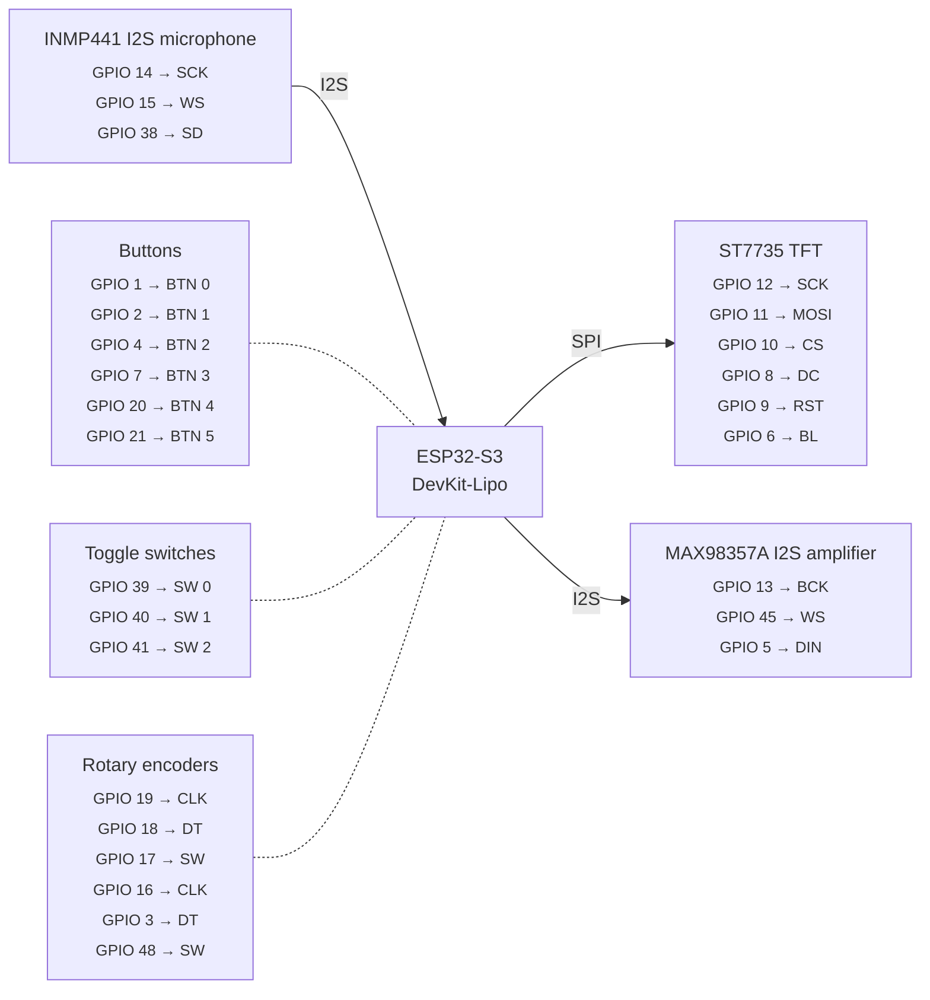

# Wiring reference

Auto-generated from `firmware/bodn/config.py`. Do not edit between the markers.

Regenerate: `uv run python tools/pinout.py --md`

<!-- pinout:start -->

### ST7735 TFT

| Signal | GPIO | Config variable |
|--------|------|-----------------|
| SCK | 12 | `TFT_SCK` |
| MOSI | 11 | `TFT_MOSI` |
| CS | 10 | `TFT_CS` |
| DC | 8 | `TFT_DC` |
| RST | 9 | `TFT_RST` |
| BL | 6 | `TFT_BL` |

### INMP441 I2S microphone

| Signal | GPIO | Config variable |
|--------|------|-----------------|
| SCK | 14 | `I2S_MIC_SCK` |
| WS | 15 | `I2S_MIC_WS` |
| SD | 38 | `I2S_MIC_SD` |

### MAX98357A I2S amplifier

| Signal | GPIO | Config variable |
|--------|------|-----------------|
| BCK | 13 | `I2S_SPK_BCK` |
| WS | 45 | `I2S_SPK_WS` |
| DIN | 5 | `I2S_SPK_DIN` |

### Buttons

| Signal | GPIO | Config variable |
|--------|------|-----------------|
| BTN 0 | 1 | `BTN_PINS[0]` |
| BTN 1 | 2 | `BTN_PINS[1]` |
| BTN 2 | 4 | `BTN_PINS[2]` |
| BTN 3 | 7 | `BTN_PINS[3]` |
| BTN 4 | 20 | `BTN_PINS[4]` |
| BTN 5 | 21 | `BTN_PINS[5]` |

### Toggle switches

| Signal | GPIO | Config variable |
|--------|------|-----------------|
| SW 0 | 39 | `SW_PINS[0]` |
| SW 1 | 40 | `SW_PINS[1]` |
| SW 2 | 41 | `SW_PINS[2]` |

### Rotary encoders

| Signal | GPIO | Config variable |
|--------|------|-----------------|
| CLK | 19 | `ENC1_CLK` |
| DT | 18 | `ENC1_DT` |
| SW | 17 | `ENC1_SW` |
| CLK | 16 | `ENC2_CLK` |
| DT | 3 | `ENC2_DT` |
| SW | 48 | `ENC2_SW` |

### All GPIOs

| GPIO | Component | Signal |
|------|-----------|--------|
| 1 | Buttons | BTN 0 |
| 2 | Buttons | BTN 1 |
| 3 | Rotary encoders | DT |
| 4 | Buttons | BTN 2 |
| 5 | MAX98357A I2S amplifier | DIN |
| 6 | ST7735 TFT | BL |
| 7 | Buttons | BTN 3 |
| 8 | ST7735 TFT | DC |
| 9 | ST7735 TFT | RST |
| 10 | ST7735 TFT | CS |
| 11 | ST7735 TFT | MOSI |
| 12 | ST7735 TFT | SCK |
| 13 | MAX98357A I2S amplifier | BCK |
| 14 | INMP441 I2S microphone | SCK |
| 15 | INMP441 I2S microphone | WS |
| 16 | Rotary encoders | CLK |
| 17 | Rotary encoders | SW |
| 18 | Rotary encoders | DT |
| 19 | Rotary encoders | CLK |
| 20 | Buttons | BTN 4 |
| 21 | Buttons | BTN 5 |
| 38 | INMP441 I2S microphone | SD |
| 39 | Toggle switches | SW 0 |
| 40 | Toggle switches | SW 1 |
| 41 | Toggle switches | SW 2 |
| 45 | MAX98357A I2S amplifier | WS |
| 48 | Rotary encoders | SW |
<!-- pinout:end -->

